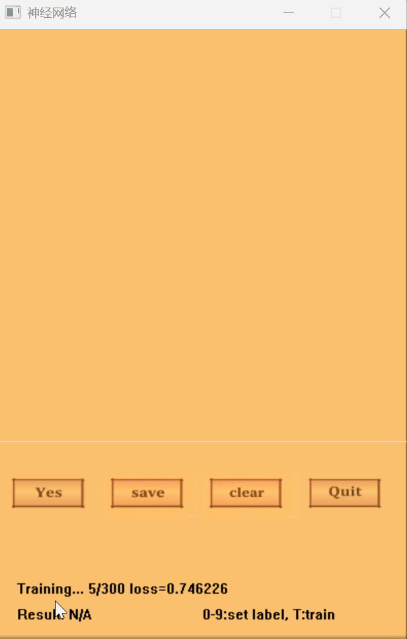
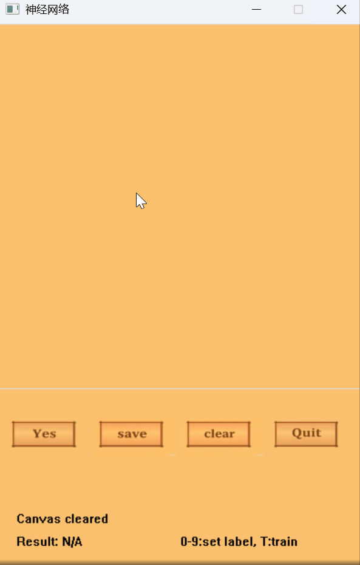
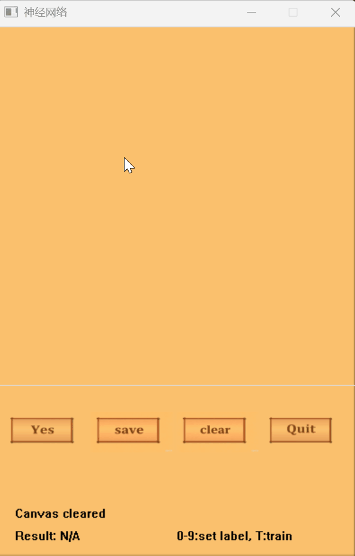

# 手写数字识别

一个从零开始用 C++ 实现的手写数字识别系统 —— 不依赖任何深度学习框架，只有原生神经网络代码，附带图形界面，支持手绘、训练和识别数字。

---

## 🖼️ 演示

| 训练过程 | 识别结果 | 添加训练数据 |
| :------: | :------: | :----------: |
|  |  |  |

---

## 🏗️ 系统架构

### 神经网络

| 项目 | 说明 |
|------|------|
| 类型 | 多层感知器（MLP），使用反向传播算法 |
| 网络结构 | `1225 → 256 → 10` |
| 输入层 | 35×35 二值网格（展平为一维） |
| 隐藏层 | 256 个神经元，激活函数 Sigmoid |
| 输出层 | 10 个神经元（数字 0–9），one‑hot 编码 |
| 权重初始化 | Xavier / He 风格，`N(0, sqrt(2 / (fan_in + fan_out)))` |
| 损失函数 | 均方误差（MSE） |
| 学习率 | 0.025，配合指数衰减（每个 epoch 乘以 0.998） |
| 训练方式 | 随机梯度下降（SGD），mini‑batch 随机打乱，共 300 轮迭代 |

### 图形界面（EasyX）

- 窗口大小：400×600 像素
- 绘图画板：400×400 像素，叠加 35×35 网格
- 四个按钮：**预测** | **保存** | **清空** | **退出**
- 实时状态栏和识别结果显示区域

---

## 📁 项目结构

```text
数字识别/
├── 神经网络/
│   ├── 神经网络.sln                  # Visual Studio 解决方案文件
│   ├── 神经网络/
│   │   ├── main.cpp                  # 程序入口 & 训练主循环
│   │   ├── net.hpp / net.cpp         # 神经网络（前向传播、反向传播、SGD）
│   │   ├── class.hpp / class.cpp     # GUI、画板、事件处理
│   │   ├── file/
│   │   │   ├── training_digits.txt   # 训练样本数据
│   │   │   ├── saving_digits_256.txt # 保存的权重文件
│   │   │   └── out.txt               # 预测输出日志
│   │   └── image/                    # UI 资源（按钮图标、背景等）
│   └── test.exe                      # 预编译的可执行文件
└── README.md
```

## ⚙️ 工作原理
绘画 — 在画板上按下鼠标左键并拖动，即可使用画笔绘制数字。

标注 — 按下键盘数字键 0–9，为当前绘制的数字设定标签。

保存 — 点击 保存 按钮，将当前绘画作为一个训练样本存入文件。

训练 — 按下键盘 T 键开始训练（共 300 轮），实时显示进度和损失值。

识别 — 点击 预测 按钮，识别画板上的数字。

## 🔧 编译与运行
环境要求
Visual Studio（项目提供 .sln / .vcxproj 解决方案文件）

EasyX 图形库

C++17（使用了 std::filesystem）

编译步骤
在 Visual Studio 中打开 神经网络/神经网络.sln

生成解决方案

仓库中已包含预编译的 test.exe，如果你的环境匹配，也可以直接运行该可执行文件

运行
```bash
# 直接运行预编译的可执行文件
神经网络/test.exe

# 或者从源码编译后运行调试输出文件
```
## 📖 使用方法
操作	方法
绘制数字	在画板上点击并拖动鼠标
设置标签	按下键盘 0–9 键
保存样本	点击 保存 按钮
训练模型	按下 T 键
识别数字	点击 预测 按钮
清空画板	点击 清空 按钮
退出程序	点击 退出 按钮
## ⚠️ 关键细节
隐藏层已从 128 个神经元升级为 256 个 —— 权重文件使用 _256 后缀，避免因维度不匹配而加载错误。

训练样本保存在 file/training_digits.txt 中，每行包含 35×35 的二值网格 + 10 维 one‑hot 标签。

训练完成后权重会自动保存，下次启动时自动加载。

识别结果以及每个数字的置信度也会写入 file/out.txt。

## 🙏 致谢
本项目参考了 B站 up主 Preprue 的视频讲解，感谢他的分享。

[](https://www.bilibili.com/video/BV1zKRRYfEVG/)

---


